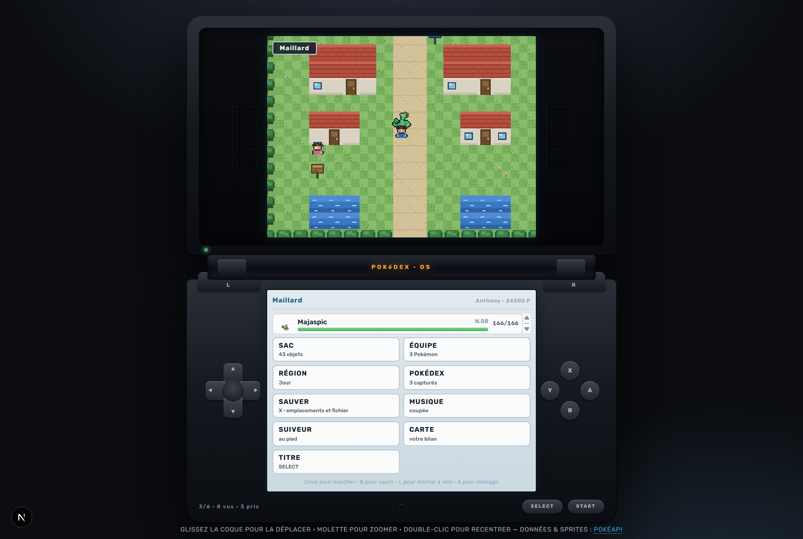

# Pokédex — Édition Unys

Une Nintendo DS qui tient dans le navigateur : deux dalles, des boutons sur
les côtés, la séquence de démarrage de Pokémon Noir et Blanc — et, dedans, un
jeu de rôle complet.



## Ce qu'il y a dedans

**Un Pokédex** consultable, les 1025 espèces, avec leurs types, leurs
statistiques, leur chaîne d'évolution et leur illustration officielle.

**Un jeu**, sur 33 cartes : quatre villes, une douzaine de routes aux biomes
variés, trois Arènes, la Ligue Pokémon et son Conseil 4, une grotte secrète,
et une Tour de Combat pour l'après-Ligue.

- **649 espèces** dans les hautes herbes, légendaires exceptés, avec leurs
  natures, leurs talents et une chance sur dix d'être chromatique
- un **moteur de combat** aux formules de la Génération V : altérations,
  météo, confusion, contrecoup, vol de PV, coups multiples, objets tenus
- une **IA** qui se soigne et change de Pokémon quand le duel tourne mal
- le **Pokémon de tête marche derrière vous**, repixellisé à la maille du jeu
- des **Cars Faure** pour voyager, un vélo, le Surf, un cycle jour / nuit
- un **PC** dans les Centres, des Capsules Techniques, un sac complet
- une **Pension** : confiez-en deux, marchez, et un œuf finit par éclore
- un **Maître des Capacités** qui réveille les attaques oubliées
- **deux emplacements de sauvegarde** et un export vers un fichier

## Lancer le jeu

```bash
npm install
npm run dev
```

Puis <http://localhost:3000>. Sur écran étroit, les deux dalles se partagent
l'affichage par onglets ; sur grand écran, la console entière est là et se
déplace à la souris.

| Commande | Effet |
| --- | --- |
| `npm run dev` | serveur de développement |
| `npm run build` | build de production |
| `npm run test` | la suite de tests (588) |
| `npm run lint` | ESLint |

## Comment c'est fait

**Aucun fichier d'image, aucun fichier de son.** Les décors, les personnages,
le vélo, l'autocar et les tuiles sont peints au pixel dans un canevas au
moment de l'exécution ([`sprites.ts`](src/lib/game/sprites.ts)). La musique et
les bruitages sont synthétisés au Web Audio, note par note
([`music.ts`](src/lib/game/music.ts)) : la bande originale des vrais jeux est
sous droits, celle-ci ne l'est pas.

**Les sprites de Pokémon** viennent de la PokéAPI. Ceux du suiveur sont
repixellisés à la volée — cadrage, réduction moyennée, palette ramenée à six
teintes, liseré sombre — pour tenir dans la même direction artistique que le
reste ([`palette.ts`](src/lib/game/palette.ts)).

**Les données d'espèces sont figées dans le dépôt.** Le jeu n'interroge jamais
le réseau en cours de partie : 649 fiches et 303 évolutions vivent dans
[`dex.ts`](src/lib/game/dex.ts), engendré une fois pour toutes par

```bash
node scripts/generer-dex.mjs
```

Le script est reproductible : relancé, il réécrit le même fichier au caractère
près.

## L'organisation du code

```
src/
  app/            la page et les styles
  components/     la console, le Pokédex, les écrans du jeu
    game/         useGame (les phases), battleFlow et worldFlow (les écrans)
  lib/
    pokeapi.ts    les sprites et les fiches du Pokédex
    game/         le moteur : combat, monde, objets, états, sauvegarde
scripts/          la génération de la table d'espèces
```

Le principe : **tout ce qui décide est pur et testable**. Les formules de
combat, les écrans, la table du monde, la palette — aucun d'eux ne touche au
DOM. `useGame` ne garde que l'enchaînement des phases, ce qui laisse les 588
tests couvrir la logique sans navigateur.

## Les tests

```bash
npm run test
```

Ils vérifient les formules de combat sur des milliers de tirages, mais aussi
la structure du monde : largeur des lignes de chaque carte, passages
réciproques, PNJ posés sur une case libre, tables de rencontre cohérentes,
arrêts de bus, portes conditionnelles. Ajouter une carte mal formée fait
échouer la suite avant même d'ouvrir le jeu.

## Crédits

Données et sprites : [PokéAPI](https://pokeapi.co). Pokémon est une marque de
Nintendo / Game Freak / The Pokémon Company — ce projet est un exercice
personnel, sans lien avec eux et sans but commercial.
